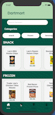
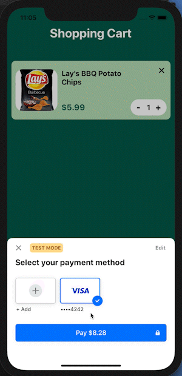
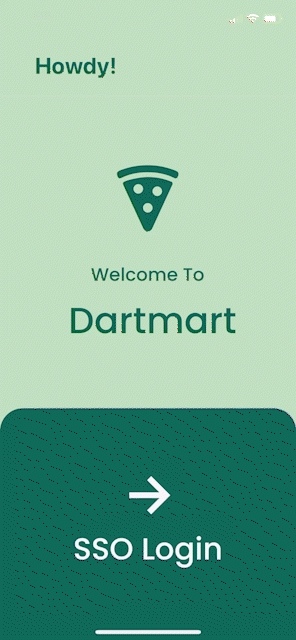
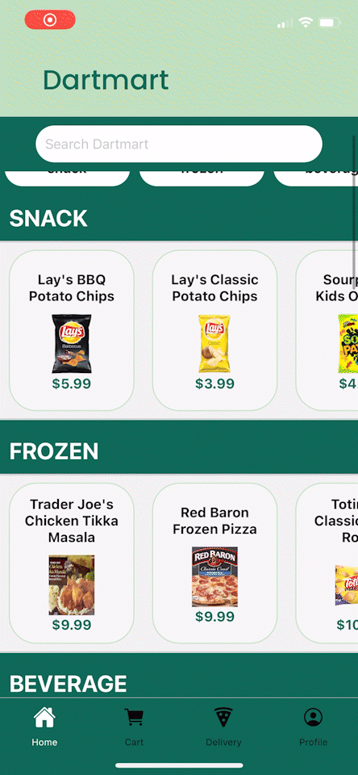
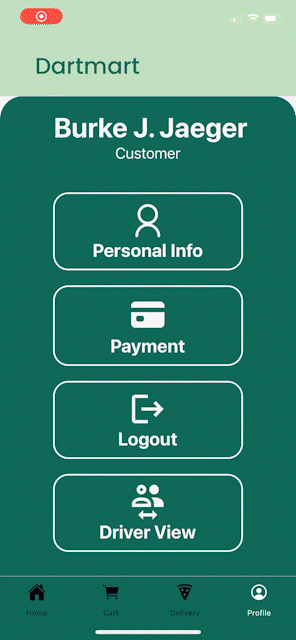

# DartMart:  On-Demand Food Delivery Anywhere on Dartmouth's Campus

## How Might We reimagine on-demand food delivery service in a viable manner for Dartmouth's remote college campus?

 Through a React Native mobile application (optimized currently for iOS), DartMart operates as a peer-run gig-style delivery application in which users may either place orders as a customer or register as a "driver" and fulfill orders. To ensure users are Dartmouth students (with access to secure campus buildings and a dedication to the betterment of their community), users are authenticated through Dartmouth's SSO Login (supported in our app by Heroku). Inventory, users, and orders are stored in a Cloud Firestore database (Firebase), which supports reading of data (such as inventory, user info, and order contents) as well as updating  data (such as order status, user roles). After perusing an inventory screen (browsable by category filters and search) and selecting desired items and quantities via popup modals, users may review cart items, taxes, and fees from the Cart Screen before completing Checkout. Payment is handled securely through a Stripe popup modal in the Cart Screen (with Stripe server hosted on Render). Order Status Updates are provided via input from the student delivering the food. Delivery View can be enabled in the Profile screen, and Delivery view displays orders available to be accepted, with detailed modals about each order providing additional information. Accepted orders are displayed with the option to cancel or complete an order via a popup modal. A user may revert from Driver view back to Customer view via the Profile Page. This application is designed with the intent of real-world use by the existing company (DartMart LLC) for future operations, and will be deployed in the near future with additional refinements.

## Architecture

Front End:  
* React Native W/Express, (tested here with Expo)

Back End: 
* Heroku (User Authentication)
* Firebase (User and order storage)
* Stripe (payment processing)
* Render.com (web service endpoints to hit stripe)[hosted Here](https://stripeserver.onrender.com)

## Setup

To test the environment locally you will need to run the front end with expo and the stripe endpoint server with node.

in project-dartmart, run:
`npm install && expo start -i`
to install package dependencies and start the IOS version of the app on your emulator.

Then
`cd server/
node index.js `

## GIFS of DartMart in Action

Payment Flow:

(Payment Flow is a long GIF so it is also available as a .mov file in this repo):

https://user-images.githubusercontent.com/62917324/172093459-304a78db-3066-4f2d-b009-71251cd42503.mov

Cancelled Payment:

Splash Screen to SSO Login:

Browse Inventory:

Search Inventory:

Switching Driver/Customer Roles + Logout:

Fulfilling Orders as a Driver:

## Authors

{
Edmund Aduse Poku,
Camden Hao,
Burke Jaeger,
Garrett Johnston,
Will McCall,
Harold Than,
}

